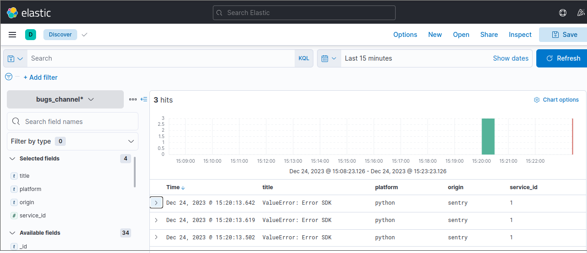
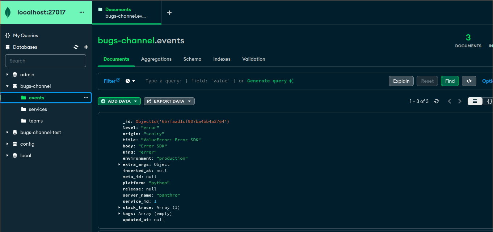

# BugsChannel


This repository contains information about handling issues with proxy.
I decided to begin this project with the goal of making error handling as simple as possible.
I use [Sentry](https://sentry.io) and [Honeybadger](https://www.honeybadger.io), and both tools are fantastic for quickly tracking down issues. However, the purpose of this project is not to replace them, but rather to provide a simple solution for you to run on premise that is easy and has significant features.

> I believe the project will be ready for production within the next three months. 🙏🏾

# Challenges
## Done 👌

- Handle Sentry events from their SDKs
- Scrub events to avoid exposing sensitive information
- Check for the presence of authentication keys
- Send events to NATs
- Get consumers (sub) and producers (pub) on board with NATS
- Create the BugsChannel logo
- Implement the rate-limit strategy
- In db-less mode, define yaml as an option
- Identify the project by the requested authentication keys
- Adds cache strategies
- Adds Mongo persistence and tasks to import yaml files
- Adds Redis as an plugin alternative
- Create a docker deployment example
- Create an example using events and Kibana

## TODO

- Adds MongoDB as an alternative for event persistence
- Generate documentation with ex_doc
- By project, implement the rate-limit strategy
- Adds PostgreSQL as an alternative for event persistence
- Support BugsChannel HTTP routes
- Grpc support
- Adds Graylog as an plugin alternative
- Adds Rabbit as a channel alternative
- Create an example using Graylog and events
- Create an example using events and PostgreSQL
- Create an event user interface
- Create a Helm Chart for Kubernetes deployments
- Adds telemetry metrics with Prometheus and StatsD as options
- Handle Honeybadger events from their SDKs
- Handle Rollbar events from their SDKs
- Create a project diagram

# Running project

The command below starts a web application that listens on port 4000 by default.


```shell
# verbose mode
export LOG_LEVEL=debug

mix api
# or
mix run --no-halt
```

The project listens on ports 4000 (local) and 4001 (sentry). At the moment, just Sentry had been set up and you could test the following steps.

- Create a config file named `config.yml` to run as **dbless** mode.

```shell
cp test/fixtures/settings/config.yml .config/config.yml
```

- Create a file named `main.py`.

```python
import sentry_sdk

sentry_sdk.init(
    "http://key@localhost:4001/1",
    traces_sample_rate=1.0,
)

raise ValueError("Error SDK")
```

- Install python packages

```shell
# using venv
python -m venv .env
. .env/bin/activate
pip install sentry-sdk

# without venv
pip install --user sentry-sdk
```

- Now you can run project

```shell
python main.py
```

## Recipes

Bugs Channel dependencies are provided by Docker; use the following command: to execute dependencies such as NATS, Redis, and Mongo.

```shell
sh dev.sh
```

# With Redis and Kibana



There is no database persistence in this mode, and Bugs Channel acts as a proxy, handling errors and request authentication and throttling, and eventually providing metrics via Prometheus and StatsD.

```shell
 LOG_LEVEL=debug DATABASE_MODE=dbless iex -S mix api
```

# With Mongo persistence



If you want to save errors in the Mongo database, use the following command:

```shell
 LOG_LEVEL=debug DATABASE_MODE=mongo iex -S mix api
```

Any Sentry integration can be used to feed errors into MongoDB.

> Events will be stored in MongoDB, and future upgrades will provide a Rest API as a backend for the Bugs Channel UI, which is the next step in creating a rich UI.


# Tests

> Principles: Of course, the acceptable test coverage is 100% guaranteed by the pipeline. 👌

```shell
mix test
# or
mix coveralls
```

# Code Analysis

Credo is in charge of maintaining code that follows certain patterns.

```shell
mix credo -a
```

# Containers

The file *dev.sh* contains a container setup for running the project locally.


# With MongoDB
# Running migrations

First and foremost, you must start your MongoDB server.

```shell
DATABASE_MODE=mongo mix mongo.migrate
```
